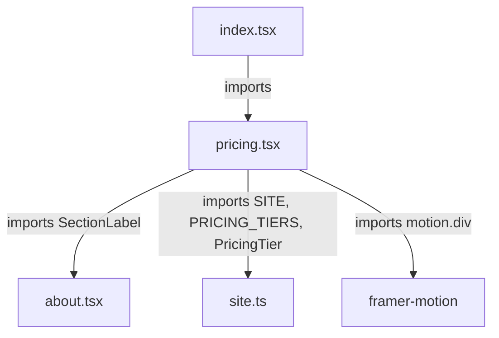
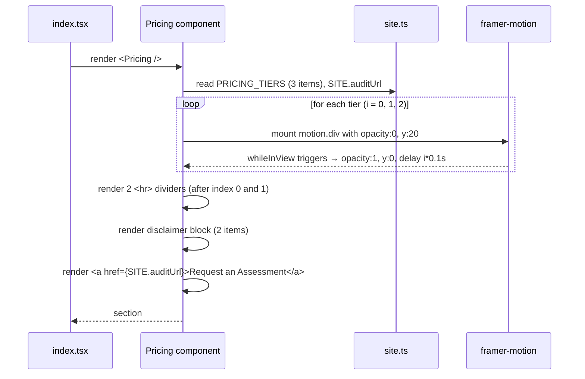

# Design Document: UGG Pricing Section (`ugg-pricing-section`)

## Overview

This document describes the technical design for adding a new **Engagement / Investment** pricing section to the UGG portfolio site. The section renders three engagement tiers (Foundation, System, Advanced) in an editorial, typographically-led layout using the existing React + TanStack Router + Tailwind v4 stack. No new dependencies are introduced; all styling relies on existing Tailwind utilities and site tokens.

---

## Architecture

The feature touches three files:

| File | Change |
|---|---|
| `src/lib/site.ts` | Add `PricingTier` interface + `PRICING_TIERS` constant |
| `src/components/portfolio/pricing.tsx` | New file — exports named `Pricing` component |
| `src/routes/index.tsx` | Import `Pricing` and insert `<Pricing />` between `<FAQ />` and `<Newsletter />` |



---

## Data Model (`src/lib/site.ts`)

### `PricingTier` Interface

Add this interface alongside the other exported interfaces at the top of `site.ts`:

```typescript
/** A single engagement tier displayed in the Pricing section */
export interface PricingTier {
  /** Zero-padded tier number, e.g. "01". Max 5 characters. */
  number: string;
  /** Plan name displayed in uppercase, e.g. "FOUNDATION". Max 50 characters. */
  name: string;
  /** Short description of the tier. Max 200 characters. */
  description: string;
  /** Human-readable price string, e.g. "FROM $1,500 USD". Max 20 characters. */
  price: string;
  /** Billing cadence descriptor, e.g. "one-time setup". Max 50 characters. */
  billing: string;
}
```

### `PRICING_TIERS` Constant

Add this constant after `FAQ_ITEMS` at the bottom of `site.ts`, following the same pattern as `COST_ITEMS` and `FAQ_ITEMS`:

```typescript
// ─── Pricing Tiers ────────────────────────────────────────────────────────────

export const PRICING_TIERS: PricingTier[] = [
  {
    number: "01",
    name: "FOUNDATION",
    description: "For businesses beginning with one high-volume support workflow.",
    price: "FROM $1,500 USD",
    billing: "one-time setup",
  },
  {
    number: "02",
    name: "SYSTEM",
    description: "For businesses requiring multiple support workflows and operational actions.",
    price: "FROM $3,500 USD",
    billing: "one-time setup",
  },
  {
    number: "03",
    name: "ADVANCED",
    description: "For businesses requiring a broader customer-support operating system.",
    price: "CUSTOM USD",
    billing: "tailored engagement",
  },
];
```

---

## Component Structure (`src/components/portfolio/pricing.tsx`)

### Imports

Exactly three import sources — no others:

```typescript
import { motion } from "framer-motion";
import { SectionLabel } from "@/components/portfolio/about";
import { SITE, PRICING_TIERS } from "@/lib/site";
import type { PricingTier } from "@/lib/site";
```

> `PricingTier` is a type-only import from `@/lib/site`, so it counts as part of the same third import source. `motion` is from `framer-motion`. `SectionLabel` is from `@/components/portfolio/about`. This satisfies Requirement 7.4 exactly.

### Full Component Code

```tsx
import { motion } from "framer-motion";
import { SectionLabel } from "@/components/portfolio/about";
import { SITE, PRICING_TIERS } from "@/lib/site";
import type { PricingTier } from "@/lib/site";

export function Pricing() {
  return (
    <section id="pricing" className="relative px-6 py-24 md:py-32">
      <div className="mx-auto max-w-6xl">

        {/* Section header */}
        <SectionLabel>Engagement / Investment</SectionLabel>
        <h2 className="mt-6 max-w-2xl font-display text-3xl font-bold sm:text-4xl md:text-5xl">
          What it costs.
        </h2>
        <p className="mt-4 max-w-2xl text-muted-foreground">
          Our engagement models are designed around the level of operational
          complexity, integrations, and ongoing support your business requires.
        </p>

        {/* Tier list */}
        <div className="mt-16">
          {PRICING_TIERS.map((tier: PricingTier, i: number) => (
            <>
              <motion.div
                key={tier.number}
                initial={{ opacity: 0, y: 20 }}
                whileInView={{ opacity: 1, y: 0 }}
                viewport={{ once: true }}
                transition={{ duration: 0.5, delay: i * 0.1 }}
                className="flex flex-col gap-3 py-8 md:flex-row md:items-start md:gap-0"
              >
                {/* Left column — tier meta + description */}
                <div className="flex flex-1 flex-col gap-2">
                  <span className="font-mono text-xs tracking-widest text-muted-foreground">
                    {tier.number}
                  </span>
                  <h3 className="font-display text-xl font-semibold uppercase tracking-widest">
                    {tier.name}
                  </h3>
                  <p className="text-sm text-muted-foreground">{tier.description}</p>
                </div>

                {/* Right column — price + billing */}
                <div className="flex flex-col gap-1 md:items-end md:text-right">
                  <span className="font-display text-2xl font-bold">{tier.price}</span>
                  <span className="font-mono text-xs text-muted-foreground">{tier.billing}</span>
                </div>
              </motion.div>

              {/* Divider between tiers — rendered after tier 01 and tier 02 only */}
              {i < PRICING_TIERS.length - 1 && (
                <hr className="border-white/10" />
              )}
            </>
          ))}
        </div>

        {/* Disclaimer block */}
        <div className="mt-10 space-y-2">
          <p className="text-sm text-muted-foreground">
            — Every engagement begins with an assessment of the existing workflow.
          </p>
          <p className="text-sm text-muted-foreground">
            — Investment is determined by scope, integrations, complexity, and
            operational requirements.
          </p>
        </div>

        {/* Assessment CTA */}
        <div className="mt-8">
          <a
            href={SITE.auditUrl}
            className="text-sm underline underline-offset-4 hover:opacity-70 transition focus-visible:ring-2 focus-visible:ring-offset-2 focus-visible:outline-none"
          >
            Request an Assessment
          </a>
        </div>

      </div>
    </section>
  );
}
```

---

## Sequence / Render Flow



---

## `index.tsx` Change

The current render order in `index.tsx` is:

```
<Hero /> → <Cost /> → <Skills /> → <Process /> → <Projects /> → <About /> → <FAQ /> → <Newsletter /> → <Contact />
```

The required canonical order per Requirement 7.6 is:

```
<Hero /> → <About /> → <Services /> → <Process /> → <CaseStudies /> → <FAQ /> → <Pricing /> → <Newsletter /> → <Footer />
```

The current `index.tsx` uses different component names (`Cost` instead of `Services`, `Projects` instead of `CaseStudies`, etc.) which already exist and whose positions must not change. The single change needed is:

**1. Add import:**

```typescript
import { Pricing } from "@/components/portfolio/pricing";
```

**2. Insert `<Pricing />` between `<FAQ />` and `<Newsletter />`:**

```tsx
// Before (excerpt):
<FAQ />
<Newsletter />

// After:
<FAQ />
<Pricing />
<Newsletter />
```

No other component positions change.

---

## Layout Design

### Desktop (≥ 768px / `md` breakpoint)

```
┌─────────────────────────────────────────────────────────────┐
│  ENGAGEMENT / INVESTMENT                                     │
│  What it costs.                                             │
│  Our engagement models are designed around…                 │
│                                                             │
│  01                              FROM $1,500 USD            │
│  FOUNDATION                      one-time setup             │
│  For businesses beginning…                                  │
├─────────────────────────────────────────────────────────────┤
│  02                              FROM $3,500 USD            │
│  SYSTEM                          one-time setup             │
│  For businesses requiring…                                  │
├─────────────────────────────────────────────────────────────┤
│  03                              CUSTOM USD                 │
│  ADVANCED                        tailored engagement        │
│  For businesses requiring a broader…                        │
│                                                             │
│  — Every engagement begins with…                           │
│  — Investment is determined by…                            │
│                                                             │
│  Request an Assessment                                      │
└─────────────────────────────────────────────────────────────┘
```

- Each tier row: `flex flex-row` with left column (`flex-1`) and right column (`items-end text-right`)
- Dividers span full width

### Mobile (< 768px)

```
┌──────────────────────────┐
│  ENGAGEMENT / INVESTMENT │
│  What it costs.         │
│  Our engagement models… │
│                          │
│  01                      │
│  FOUNDATION              │
│  For businesses…         │
│  FROM $1,500 USD         │
│  one-time setup          │
├──────────────────────────┤
│  02                      │
│  SYSTEM                  │
│  For businesses…         │
│  FROM $3,500 USD         │
│  one-time setup          │
├──────────────────────────┤
│  03                      │
│  ADVANCED                │
│  For businesses…         │
│  CUSTOM USD              │
│  tailored engagement     │
│                          │
│  — Every engagement…    │
│  — Investment is…       │
│                          │
│  Request an Assessment   │
└──────────────────────────┘
```

- Each tier row: `flex flex-col` (single column stack)
- Price and billing left-aligned on mobile (default), right-aligned only on `md:` and above via `md:items-end md:text-right`

---

## Typography Hierarchy

| Element | Classes |
|---|---|
| Tier number | `font-mono text-xs tracking-widest text-muted-foreground` |
| Plan name (`<h3>`) | `font-display text-xl font-semibold uppercase tracking-widest` |
| Description | `text-sm text-muted-foreground` |
| Price | `font-display text-2xl font-bold` |
| Billing cadence | `font-mono text-xs text-muted-foreground` |
| Disclaimer items | `text-sm text-muted-foreground` |

---

## Animation Specification

Each tier's `motion.div` uses:

```typescript
initial={{ opacity: 0, y: 20 }}
whileInView={{ opacity: 1, y: 0 }}
viewport={{ once: true }}
transition={{ duration: 0.5, delay: i * 0.1 }}
```

- `i = 0` → delay `0.0s` (Foundation)
- `i = 1` → delay `0.1s` (System)
- `i = 2` → delay `0.2s` (Advanced)
- `once: true` — animation fires once on first viewport entry, does not repeat on scroll

---

## Divider Logic

The divider condition `i < PRICING_TIERS.length - 1` renders an `<hr>` after indices 0 and 1 only (after Foundation and after System). No divider renders after index 2 (Advanced). This satisfies Requirements 2.7 and 2.8.

```
Tier 0 (Foundation)  →  render <hr>
Tier 1 (System)      →  render <hr>
Tier 2 (Advanced)    →  NO <hr>
```

---

## CTA Styling

The Assessment CTA is a plain `<a>` tag — **not** a pill button:

```tsx
<a
  href={SITE.auditUrl}
  className="text-sm underline underline-offset-4 hover:opacity-70 transition focus-visible:ring-2 focus-visible:ring-offset-2 focus-visible:outline-none"
>
  Request an Assessment
</a>
```

- No `rounded-full`, no `bg-*`, no `border` — purely typographic
- `hover:opacity-70 transition` — animated opacity on hover
- `focus-visible:ring-2` — keyboard-only focus ring (not shown on mouse click)
- Accessible name is the visible text content; no `aria-label` needed

---

## Accessibility

| Requirement | Implementation |
|---|---|
| Heading hierarchy | Section uses `<h2>`, plan names use `<h3>` inside it |
| CTA accessible name | Visible text "Request an Assessment" is the accessible name |
| Focus ring | `focus-visible:ring-2` on the CTA `<a>` |
| No `aria-hidden` on interactive elements | The `<a>` carries no `aria-hidden` |
| Tab order | Follows visual DOM order: tiers top-to-bottom, CTA last |
| Colour contrast | Relies on existing site tokens (`text-muted-foreground`, `text-foreground`) which are already used site-wide and meet WCAG AA |

---

## Requirements Traceability

| Requirement | Design Element |
|---|---|
| 1.1 — `id="pricing"`, between FAQ and Newsletter | `<section id="pricing">` in pricing.tsx; inserted in index.tsx between `<FAQ />` and `<Newsletter />` |
| 1.2 — `SectionLabel` with "ENGAGEMENT / INVESTMENT" | `<SectionLabel>Engagement / Investment</SectionLabel>` |
| 1.3 — `<h2>` "What it costs." | `<h2 className="...">What it costs.</h2>` |
| 1.4 — supporting `<p>` | `<p className="mt-4 max-w-2xl text-muted-foreground">Our engagement models…</p>` |
| 1.5 — `whileInView` animation | `motion.div` with `initial/whileInView/viewport/transition` per tier |
| 1.6 — all tier fields present in DOM | All five fields (number, name, description, price, billing) rendered as non-empty text nodes |
| 2.1 — exactly three tiers in order | `PRICING_TIERS` array has 3 items in correct order |
| 2.2 — zero-padded number in `font-mono text-muted-foreground` | `<span className="font-mono text-xs tracking-widest text-muted-foreground">{tier.number}</span>` |
| 2.3 — plan name in `font-display` uppercase `tracking-widest` | `<h3 className="font-display text-xl font-semibold uppercase tracking-widest">` |
| 2.4 — description ≤ 120 chars, `text-sm text-muted-foreground` | All descriptions are under 120 chars; `<p className="text-sm text-muted-foreground">` |
| 2.5 — price in `font-display text-2xl`, right-aligned desktop | `<span className="font-display text-2xl font-bold">`, right column `md:items-end md:text-right` |
| 2.6 — billing in `font-mono text-xs text-muted-foreground` | `<span className="font-mono text-xs text-muted-foreground">` in right column |
| 2.7/2.8 — exactly two dividers, none after last | `i < PRICING_TIERS.length - 1` condition on `<hr>` |
| 3.1–3.5 — disclaimer block | Two `<p>` tags preceded by em dash, `text-sm text-muted-foreground` |
| 4.1 — CTA href = `SITE.auditUrl` | `href={SITE.auditUrl}` |
| 4.2 — label "Request an Assessment" | Visible text in `<a>` |
| 4.3 — underline-only, no pill | `underline underline-offset-4`, no `rounded-full`, no `bg-*` |
| 4.4 — `hover:opacity-70 transition` | `hover:opacity-70 transition` classes |
| 4.5 — `focus-visible:ring-2` | `focus-visible:ring-2 focus-visible:ring-offset-2 focus-visible:outline-none` |
| 5.1 — two-column on `md` | `md:flex-row` on tier wrapper, `md:items-end md:text-right` on price column |
| 5.2 — single column on mobile | `flex flex-col` default, overridden at `md:` |
| 5.3 — dividers full width | `<hr>` is a block element, spans full parent width |
| 5.4 — `max-w-2xl` on heading/paragraph | `max-w-2xl` on both `<h2>` and `<p>` |
| 6.1 — `<h2>` under page `<h1>` | Page `<h1>` is in `<Hero>`, `<h2>` is in `<Pricing>` |
| 6.2 — `<h3>` for plan names | `<h3>` wraps `{tier.name}` |
| 6.3 — CTA accessible name from visible text | No `aria-label` needed; text content is the accessible name |
| 7.1 — new file, named export | `src/components/portfolio/pricing.tsx` exports `export function Pricing()` |
| 7.2 — data in `site.ts` | `PRICING_TIERS: PricingTier[]` added to `site.ts` |
| 7.3 — `PricingTier` interface in `site.ts` | Interface defined with all five fields and character constraints |
| 7.4 — exactly three import sources | `framer-motion`, `@/components/portfolio/about`, `@/lib/site` |
| 7.5 — no new dependencies or global CSS | All classes are existing Tailwind utilities; no `package.json` changes |
| 7.6 — canonical component order in `index.tsx` | `<Pricing />` inserted between `<FAQ />` and `<Newsletter />`; no other positions change |

---

## Dependencies

No new dependencies. All capabilities used are already present in the project:

- `framer-motion` — already used in `about.tsx`, `faq.tsx`, `cost.tsx`, `contact.tsx`, `newsletter.tsx`
- `SectionLabel` — already exported from `about.tsx` and used across the codebase
- `SITE` — already exported from `site.ts`
- Tailwind utilities — all classes (`font-mono`, `font-display`, `text-muted-foreground`, `underline`, `focus-visible:ring-2`, etc.) are used elsewhere in the project

---

## Components and Interfaces

### `Pricing` Component

**File**: `src/components/portfolio/pricing.tsx`

**Purpose**: Renders the Engagement / Investment section with three pricing tiers, dividers, disclaimer, and CTA.

**Interface**:

```typescript
// No props — all data sourced from site.ts constants
export function Pricing(): JSX.Element
```

**Responsibilities**:
- Import and map over `PRICING_TIERS` to render each tier row
- Apply `framer-motion` `whileInView` entrance animation per tier
- Render exactly two `<hr>` dividers between tiers (not after the last)
- Render the disclaimer block with em-dash markers
- Render the Assessment CTA as a plain `<a>` link

### `SectionLabel` Sub-Component (existing, imported)

**File**: `src/components/portfolio/about.tsx` (re-used, not modified)

**Interface**:

```typescript
export function SectionLabel({ children }: { children: React.ReactNode }): JSX.Element
```

### `PricingTier` Interface (data model, in `site.ts`)

```typescript
export interface PricingTier {
  number: string;      // max 5 chars, e.g. "01"
  name: string;        // max 50 chars, e.g. "FOUNDATION"
  description: string; // max 200 chars
  price: string;       // max 20 chars, e.g. "FROM $1,500 USD"
  billing: string;     // max 50 chars, e.g. "one-time setup"
}
```

---

## Data Models

### `PricingTier`

Defined in `src/lib/site.ts`. Represents one engagement tier row in the pricing section.

```typescript
export interface PricingTier {
  /** Zero-padded display number. Max 5 characters. e.g. "01" */
  number: string;
  /** All-caps plan name. Max 50 characters. e.g. "FOUNDATION" */
  name: string;
  /** Short description of scope. Max 200 characters. */
  description: string;
  /** Human-readable price. Max 20 characters. e.g. "FROM $1,500 USD" */
  price: string;
  /** Billing cadence. Max 50 characters. e.g. "one-time setup" */
  billing: string;
}
```

**Validation Rules** (enforced at definition time via field lengths):
- `number`: non-empty, zero-padded two-digit string ("01"–"99")
- `name`: non-empty, uppercase string
- `description`: non-empty, ≤ 120 characters for display compliance
- `price`: non-empty, human-readable currency string
- `billing`: non-empty, describes payment cadence

### `PRICING_TIERS` Constant

```typescript
export const PRICING_TIERS: PricingTier[] = [
  { number: "01", name: "FOUNDATION",
    description: "For businesses beginning with one high-volume support workflow.",
    price: "FROM $1,500 USD", billing: "one-time setup" },
  { number: "02", name: "SYSTEM",
    description: "For businesses requiring multiple support workflows and operational actions.",
    price: "FROM $3,500 USD", billing: "one-time setup" },
  { number: "03", name: "ADVANCED",
    description: "For businesses requiring a broader customer-support operating system.",
    price: "CUSTOM USD", billing: "tailored engagement" },
];
```

---

## Correctness Properties

Property 1: Tier count invariant — `PRICING_TIERS.length === 3`. The section always renders exactly three tiers; adding or removing a tier from the constant is the only way to change the count.

**Validates: Requirements 2.1**

Property 2: Divider count invariant — the number of rendered `<hr>` elements equals `PRICING_TIERS.length - 1` (= 2). There is always exactly one fewer divider than tiers, and no divider appears after the last tier.

**Validates: Requirements 2.7, 2.8**

Property 3: Animation delay ordering — for tier at index `i`, `transition.delay === i * 0.1`. Delays are strictly increasing: 0.0s, 0.1s, 0.2s. No two tiers share the same delay value.

**Validates: Requirements 1.5**

Property 4: CTA href validity — `SITE.auditUrl` is a statically defined non-empty string constant. The `<a href={SITE.auditUrl}>` is always set and never resolves to an empty or undefined href.

**Validates: Requirements 4.1**

Property 5: Heading hierarchy — the `<h2>` "What it costs." is always a descendant of the page and a sibling of the `<h1>` in `<Hero>`. Each `<h3>` plan name is always a descendant of that `<h2>`.

**Validates: Requirements 6.1, 6.2**

Property 6: Disclaimer item count — always exactly two `<p>` elements in the disclaimer block, each beginning with an em dash character (—).

**Validates: Requirements 3.1, 3.4**

Property 7: Import closure — `pricing.tsx` imports from exactly three module paths: `framer-motion`, `@/components/portfolio/about`, and `@/lib/site`. No fourth import source is present.

**Validates: Requirements 7.4**

---

## Error Handling

### Missing `SITE.auditUrl`

`SITE.auditUrl` is defined as a string constant (`"/business-efficiency-assessment"`). It cannot be `undefined` at runtime. No runtime guard is needed, but if `SITE.auditUrl` were ever an empty string, the `<a href="">` would resolve to the current page — which is acceptable fallback behaviour (no broken link, no crash).

### Empty `PRICING_TIERS`

If `PRICING_TIERS` is ever empty (guard against future accidental modification), the `map` renders nothing and the section renders with a heading/paragraph but no tier rows, disclaimer, or CTA. This degrades gracefully without throwing. The data is a static constant so this scenario is only a developer error detectable in code review.

### Animation Failure

`framer-motion` is a hard dependency already present in the project. If it fails to import, the build will fail at compile time — not silently at runtime. No runtime fallback is required.

---

## Testing Strategy

### Unit Testing Approach

- Render `<Pricing />` in isolation using the project's existing test setup (Vitest + React Testing Library, per `vitest.config.ts`).
- Assert: section element has `id="pricing"`.
- Assert: exactly three tier name headings (`h3`) are present in the DOM.
- Assert: exactly two `<hr>` elements are present.
- Assert: the `<a>` with text "Request an Assessment" has `href="/business-efficiency-assessment"`.
- Assert: all tier fields (number, name, description, price, billing) are present as non-empty text nodes.
- Assert: the disclaimer block contains exactly two `<p>` elements starting with "—".

### Property-Based Testing Approach

Not applicable for this component — the data set is a fixed static constant with three well-defined items. There are no user inputs or variable data paths to explore with generative testing.

### Integration Testing Approach

- Render `<Index />` (the full page route) and assert `<section id="pricing">` exists in the output.
- Assert the DOM order: the pricing section appears after the FAQ section and before the Newsletter section by comparing their relative `compareDocumentPosition` values.
